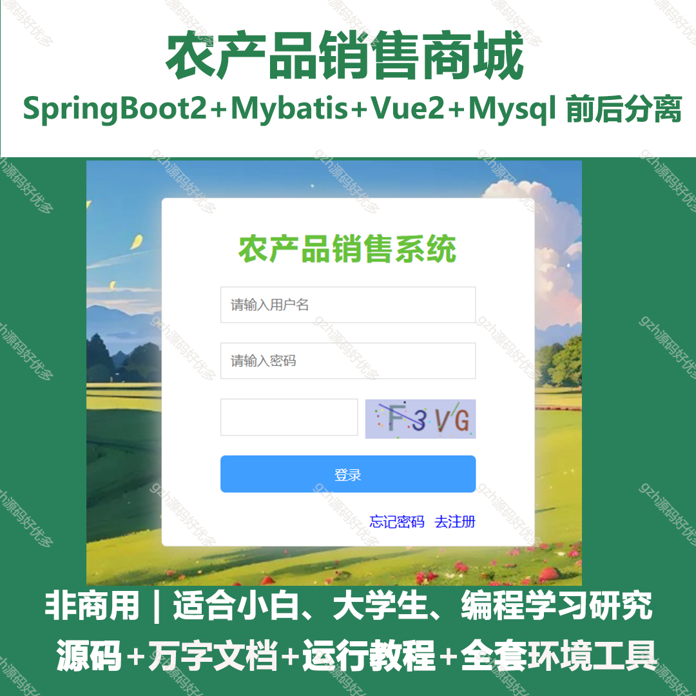
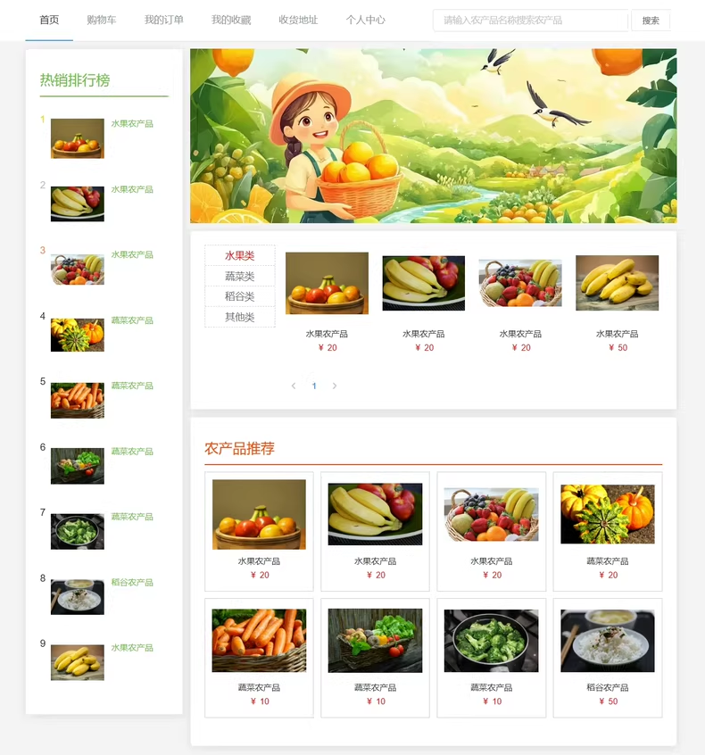
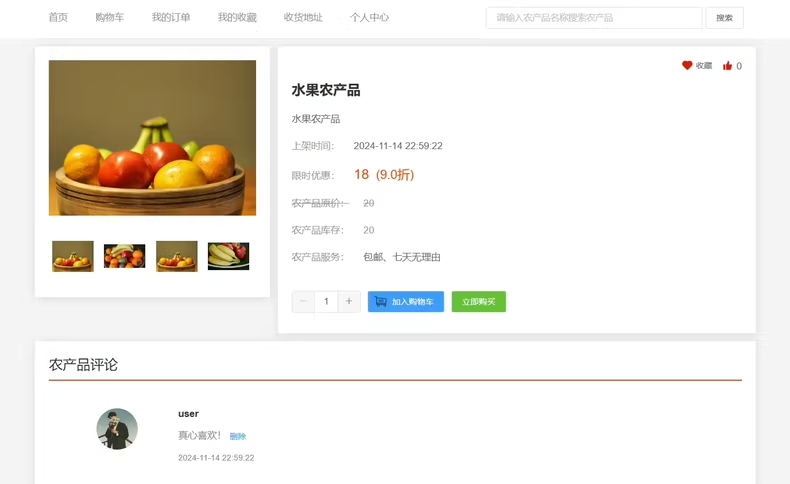
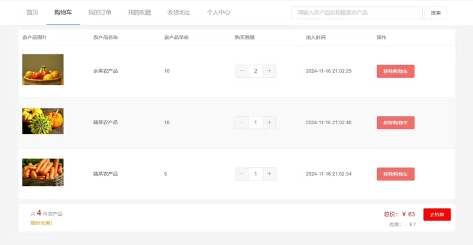
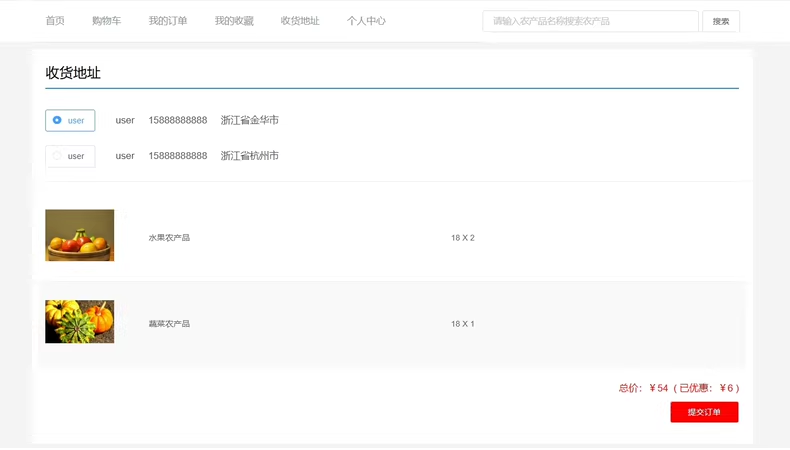
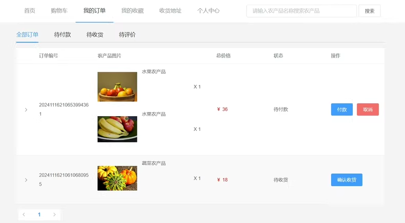
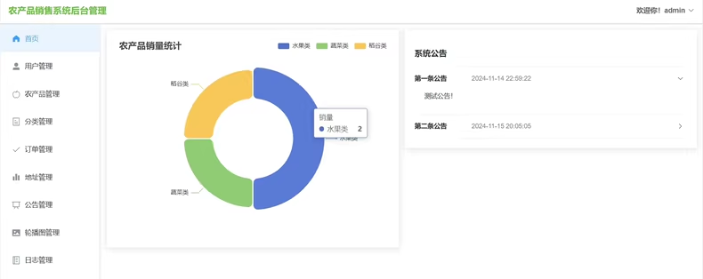
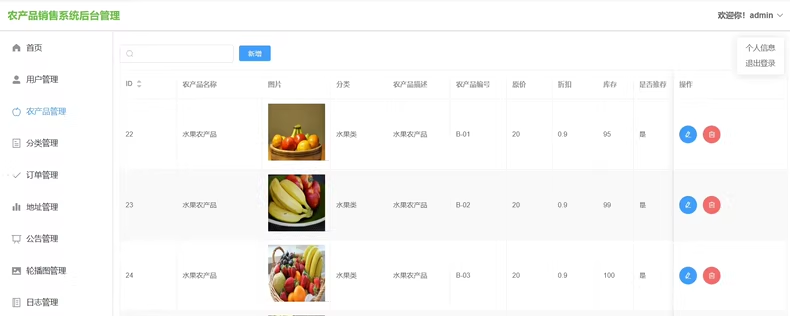
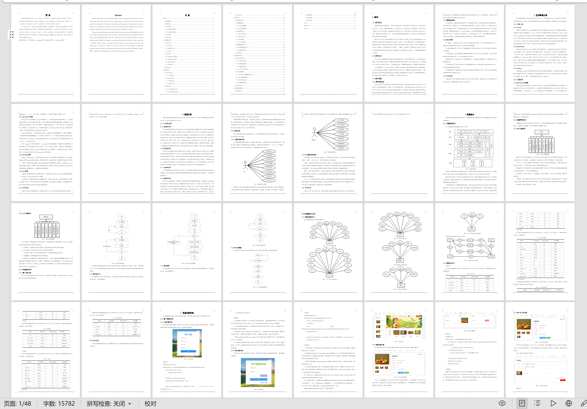
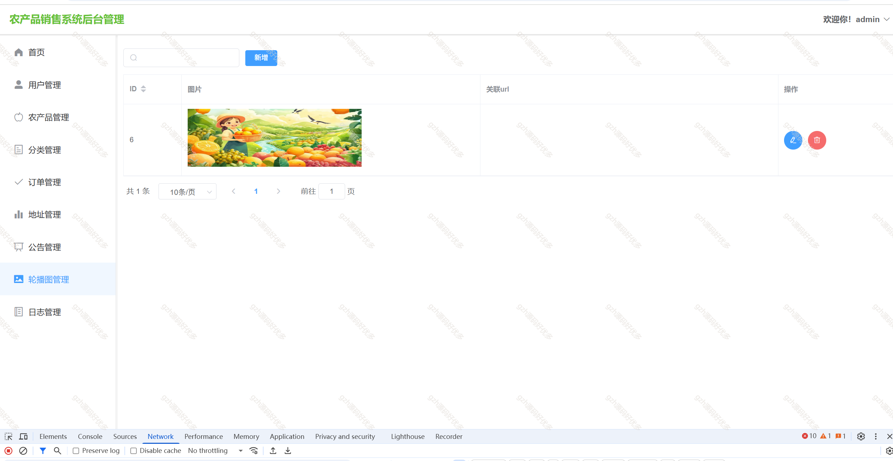

# springbootA368
springbootA368农产品销售商城LW
 
## 查看主页获取源码

### 一、关键词

农产品商城、蔬菜水果商城、绿色农产品商城、助农推广平台、助农产品商城，农产品销售系统

### 二、作品包含

源码+数据库+万字文档+全套环境和工具资源+部署教程

### 三、项目技术

前端技术：Html、Css、Js、Vue2.0、Element-ui 
数据库：MySQL
后端技术：Java、SpringBoot2.0、MyBatis

  

### 四、运行环境

开发工具：IDEA/eclipse  + vscode

数据库：MySQL5.7（最低要5.7版本）

数据库管理工具：Navicat10以上版本

环境配置软件： JDK1.8 + Maven3.6.3

前端Nodejs：16

浏览器：谷歌浏览器

### 五、项目介绍

项目编号：springbootA368

开发一款农产品销售系统可以解决人们出现购物问题，省去线下购物的时间，给人们带来极大的便利。同时对于管理人员来说，完善的后台管理系统可以最大程度上省去人力物力的投入，传统需要三个人进行统计记录的工作现在一个人就能轻松完成，计算机管理系统的介入让管理更为高效快捷。

系统分用户和管理员2个角色：
用户功能：
登录、注册、农产品搜索、农产品购买、农产品收藏、农产品评价、购物车、我的订单、个人中心

管理员功能：
用户管理、农产品管理、分类管理、订单管理、地址管理、轮播图管理、系统管理

### 六、运行截图

